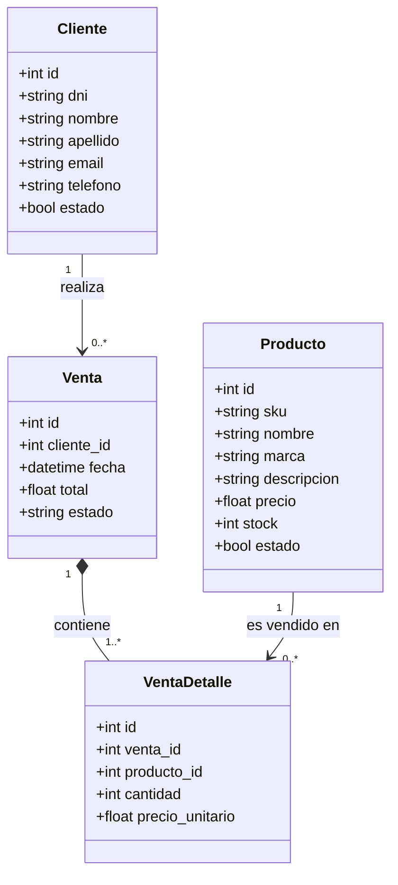

# Modelo de dominio

Sistema de gestión de Clientes, Productos y Ventas — Ingeniería de Software III.

## Diagrama de clases

## Entidades

### Cliente
Persona a la que se le pueden emitir ventas.

| Campo | Tipo | Restricciones |
|---|---|---|
| id | int | PK, autogenerado |
| dni | string | único, obligatorio |
| nombre | string | obligatorio, solo letras |
| apellido | string | obligatorio, solo letras |
| email | string | único, obligatorio, formato `usuario@dominio` |
| telefono | string | obligatorio, solo números y guiones |
| estado | bool | `true` = activo, `false` = dado de baja (default `true`) |

### Producto
Ítem del catálogo, con stock controlado.

| Campo | Tipo | Restricciones |
|---|---|---|
| id | int | PK, autogenerado |
| sku | string | único, obligatorio (código de producto) |
| nombre | string | obligatorio, solo letras |
| marca | string | obligatorio, solo letras |
| descripcion | string | opcional |
| precio | float | obligatorio, > 0 |
| stock | int | ≥ 0 (en el alta debe ser > 0; puede llegar a 0 por ventas) |
| estado | bool | `true` = activo, `false` = dado de baja (default `true`) |

### Venta
Transacción comercial entre el sistema y un Cliente, compuesta por uno o más ítems.

| Campo | Tipo | Restricciones |
|---|---|---|
| id | int | PK, autogenerado |
| cliente_id | int | FK → Cliente, obligatorio |
| fecha | datetime | autogenerada al crear |
| total | float | calculado como Σ (cantidad × precio_unitario) de sus detalles |
| estado | string | `"Confirmada"` \| `"Anulada"` (default `"Confirmada"`) |

### VentaDetalle
Línea de una Venta: un producto, su cantidad y el precio unitario **vigente al momento de la venta** (se copia, no se referencia, para que cambios futuros de precio no alteren ventas ya emitidas).

| Campo | Tipo | Restricciones |
|---|---|---|
| id | int | PK, autogenerado |
| venta_id | int | FK → Venta, obligatorio |
| producto_id | int | FK → Producto, obligatorio |
| cantidad | int | > 0 |
| precio_unitario | float | snapshot del precio del producto al momento de la venta |

## Relaciones

- **Cliente 1 — 0..\* Venta**: un cliente puede tener cero o muchas ventas; una venta pertenece a un único cliente.
- **Venta 1 — 1..\* VentaDetalle**: toda venta tiene al menos un ítem. Al eliminar una Venta se eliminan en cascada sus VentaDetalle.
- **Producto 1 — 0..\* VentaDetalle**: un producto puede estar incluido en cero o muchas líneas de venta.

## Reglas de negocio (invariantes)

- Un **Cliente inactivo** no puede ser asignado a una nueva Venta.
- El **stock** de un Producto nunca es negativo: se descuenta al confirmar una Venta y se restituye íntegramente al anularla o al quitar/reducir un ítem en una modificación.
- Una Venta **anulada** no puede volver a anularse ni modificarse.
- Un Cliente o Producto **dado de baja** no puede volver a darse de baja (el sistema lo advierte).
- La baja de Cliente y de Producto es **lógica** (cambio de `estado`), nunca elimina el registro ni su historial de ventas asociado.
